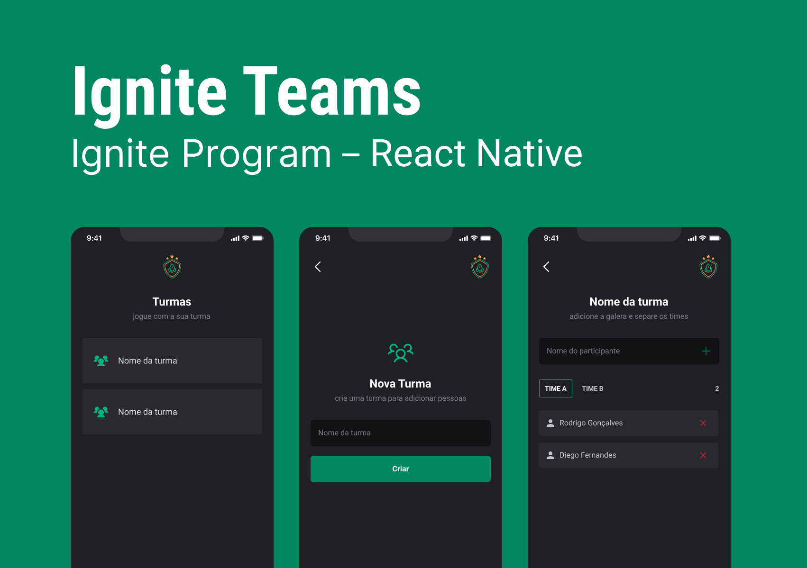
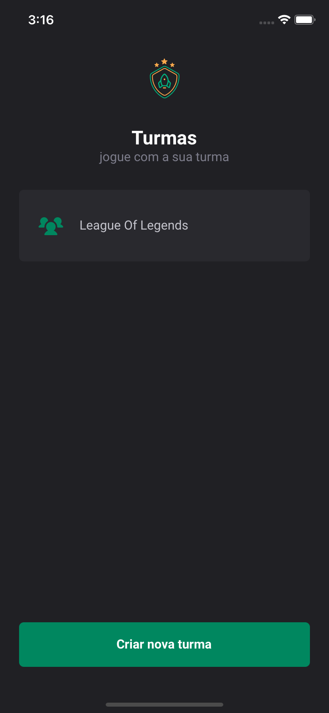
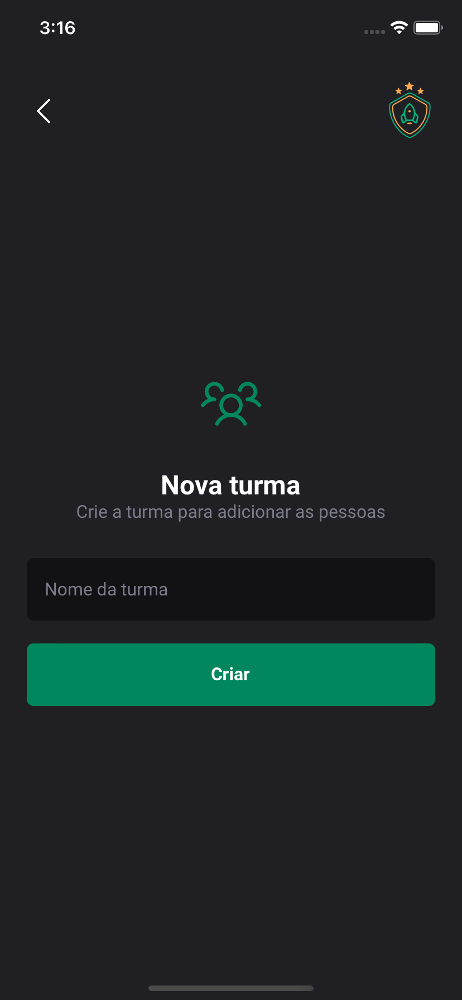
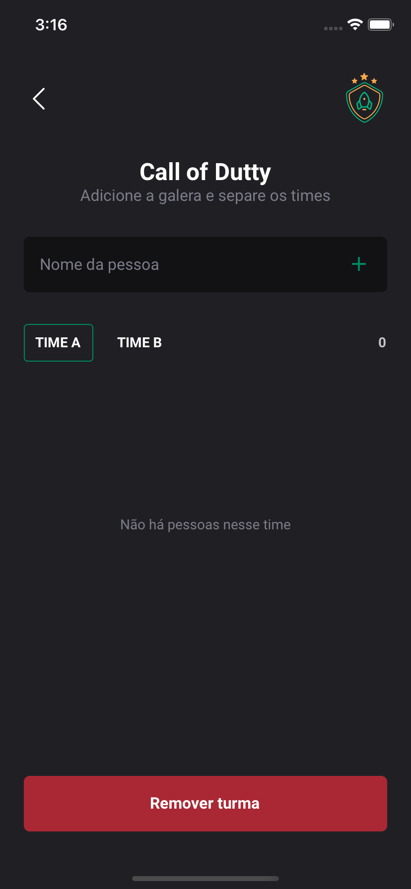

# **Ignite Teams**



## **Description**

This application was developed during the [course Ignite](https://www.rocketseat.com.br/ignite).
The application was created using Expo, and CSS-in-JS (styled-components) was used for component styling. <br /><br />
The application allows users to create teams for playing games. Users can effortlessly create groups and divide them into two teams, while also adding players to each team.<br />

## **Screenshots**

<div>



</div>

## **Prerequisites**

Set up the necessary environment for developing a React Native application using Expo. You can do this according to the official [documentation](https://reactnative.dev/docs/environment-setup?guide=quickstart).

## **Instalation**

```bash
# Clone the project
$ git clone https://github.com/leandrodsi/ignite-teams.git

# Access the folder
$ cd ignite-teams

# Install the dependencies
$ npm install

# Start the project
$ npm start

```

## **Contribution**

The project was developed for learning purposes only. If you want to contribute with any improvement (code or idea) or provide constructive criticism, feel free to use the [issues](https://github.com/leandrodsi/ignite-gym/issues) tab.

## **Contact**

📞 <a href="tel:+351933968325">+351 933 968 325</a> <br />
 ✉️ <a href="mailto:leandrodsystems@gmail.com">leandrodsystems@gmail.com</a>
